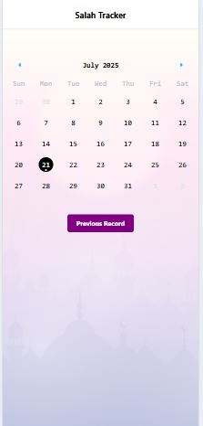
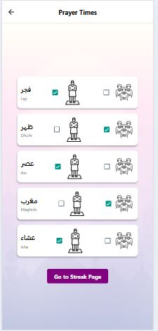
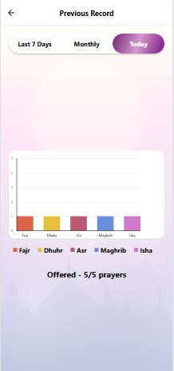
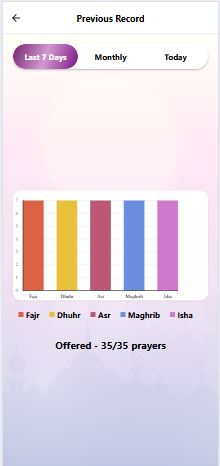
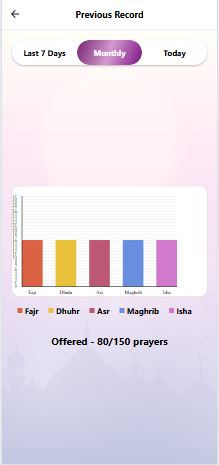
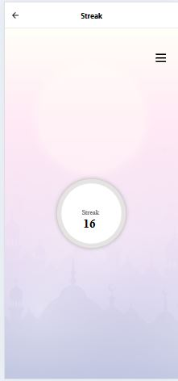

# SalahTrackerApp
A React Native mobile application for tracking daily prayers, offering a calendar view, prayer completion logging, and visual statistics on prayer habits and streaks.

| | | |
|:-------------------------:|:-------------------------:|:-------------------------:|
|  |  |  |
|  |  |  |

## Introduction
Salah Tracker is a comprehensive prayer monitoring application that helps Muslims maintain consistency in their prayers. The app tracks prayer completion with individual/jamaat options, visualizes prayer history through custom charts, and maintains streaks using React Native and Redux.

## Features
- Five daily prayers tracking (Fajr, Dhuhr, Asr, Maghrib, Isha)
- Dual prayer logging (individual/jamaat) with checkboxes  
- Three analytics views: Today, Last 7 Days, and Monthly  
- Custom SVG chart visualizations with dynamic scaling  
- Prayer streak counter with visual indicator  
- Offline data storage with AsyncStorage and JSON serialization  

## Technologies Used
- React Native (Expo)  
- Redux Toolkit with async thunks (State Management)  
- React Navigation (Stack + Material Top Tabs)  
- Custom SVG charts (Data Visualization)  
- AsyncStorage (Local Persistence)  
- LinearGradient for custom UI components  

## Installation
1. Clone repository: `git clone [repo-url]`  
2. Install dependencies: `npm install`  
3. Start development server: `expo start`  

## Key Components
1. **Calendar Screen**:  
   - Islamic date selection with marked days  
   - Navigate to specific prayer dates  

2. **Prayer Screen**:  
   - Real-time data persistence with Redux  
   - Custom checkbox components for prayer tracking  

3. **Analytics Screen**:  
   - Material Top Tabs for time period navigation  
   - Custom SVG bar charts with responsive scaling  
   - Prayer completion statistics (5/5, 35/35, 150/150 ratios)  

4. **Streak Screen**:  
   - SVG-based circular streak counter  
   - Persistent streak calculation logic  